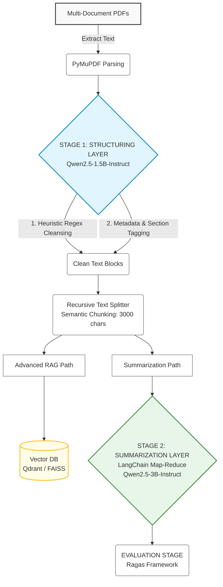

# Local-LLM-Summarizer-for-Academic-Papers

A high-performance, cost-effective, and privacy-focused Local RAG (Retrieval-Augmented Generation) and document summarization system architecture. This project is designed to ingest, structure, index, and summarize dense, multi-document academic paper libraries locally on consumer-grade hardware (CPU-bound environments), eliminating 100% of commercial LLM API costs.

---

## System Architecture

To prevent cognitive overload in smaller Open-Source LLMs and mitigate the "Lost in the Middle" phenomenon, the system decouples layout parsing, data ingestion, semantic retrieval, and final synthesis into an orchestrated pipeline.


---

## Tech Stack and Tooling

* Orchestration and Frameworks: LangChain / LangGraph
* Local Inference Engine: Ollama / vLLM (Optimized for CPU and Quantized model throughput)
* Open-Source LLMs: Qwen2.5-1.5B (Structuring), Qwen2.5-3B-Instruct / Llama-3.2-3B (Summarization)
* Vector Database: Qdrant / FAISS (Local embedding indexation)
* Data Extraction: PyMuPDF
* Evaluation and Observability: Ragas Framework

---

## Key Architectural Features

### 1. Multi-Stage Execution Pipeline
* Layer 1 (Structuring Stage): Employs a highly efficient Qwen2.5-1.5B model paired with heuristic Regex to scrub structural noise (headers, footers, citation brackets) and wrap text blocks in functional XML-like tags (<abstract>, <methodology>, <results>).
* Layer 2 (Summarization Stage): Implements LangChain's Map-Reduce pattern. Text chunks are processed in parallel during the Map phase, and synthesized into a coherent academic summary during the Reduce phase using Qwen2.5-3B-Instruct.

### 2. Advanced RAG Pattern for Multi-Document Querying
* Documents are processed via semantic chunking to maintain context boundaries.
* Generated embeddings are indexed in local Vector Databases (Qdrant/FAISS), allowing users to execute cross-document semantic searches across dozens of uploaded papers instantly.

### 3. CPU-Bound Optimization
* Utilizes quantized models (GGUF formats via Ollama) to enable stable local token generation speeds (~15 tokens/sec) entirely on a standard laptop CPU, bypassing expensive GPU infrastructure requirements.

### 4. AI Observability and Evaluation
* Integrates the Ragas framework to mathematically measure generation quality using three core metrics:
    * Faithfulness: Evaluates if the summary strictly adheres to the source document (Hallucination tracking).
    * Answer Relevance: Assesses if the generated text directly answers the academic prompt.
    * Context Recall: Ensures no vital methodologies or findings are omitted during the chunking phase.

---

## Installation and Setup

Since the project is currently in the architectural and environment initialization phase, follow these setup steps to prepare your local machine for system deployment:

### 1. Prerequisites & Local LLM Engine
This architecture runs entirely offline. You need to install the Ollama engine to host and serve the quantized models locally.
1. Download and install **Ollama** from the [Official Website](https://ollama.com/).
2. Once installed, open your terminal and pull the optimized models required for the multi-stage pipeline:
```bash
   ollama pull qwen2.5:1.5b
   ollama pull qwen2.5:3b
```

### 2. Environment Initialization
Instead of cloning directly, please **Fork** this repository to your own GitHub account first to track your contributions and customizations, then clone your forked version:

1. Click the **Fork** button at the top-right corner of this page.
2. Clone your personal forked repository to your local machine
3. Create and activate an isolated Python virtual environment:
```bash
# Windows (CMD/PowerShell)
   python -m venv venv
   .\venv\Scripts\activate
```
```bash
   # macOS / Linux
   python3 -m venv venv
   source venv/bin/activate
```

### 3. Dependencies Installation
Install the core AI framework tools and hardware-optimized packages:
```bash
pip install -r requirements.txt
```
**Note on Hardware Control:** The requirements.txt file is explicitly configured with faiss-cpu instead of the GPU variant. This ensures seamless compilation and execution in non-GPU or consumer-grade hardware environments, eliminating the need for complex NVIDIA CUDA driver configurations.

### 4. Configuration Setup
The system uses environment variables to handle local endpoint routes and decouple model names from the core code logic:
1. Create your local configuration file by copying the provided template:
```bash
cp .env_example .env
```

## Project Roadmap (Conceptual to Production)

- [x] System Architecture and Component Mapping
- [x] LLM Model Selection and Hardware Profiling (CPU Constraints)
- [ ] Local Ollama / vLLM Environment Setup
- [ ] PyMuPDF Data Ingestion and Chunking Logic
- [ ] LangChain Map-Reduce Pipeline Implementation
- [ ] Local Qdrant Integration for Multi-Doc RAG Queries
- [ ] Ragas Framework Evaluation Benchmarking
